<div align="center">

# TempusOnePS Quantitative Trading Ecosystem

**Production-grade, end-to-end algorithmic trading and quantitative research platform tailored for Vietnamese equity and derivative markets (VN30F1M).**

[](https://www.python.org/)
[](#license--security)
[](#ecosystem-architecture)
[](#executive-overview)
[](#stage-5-live-execution--operations)

[Architecture](#ecosystem-architecture) • [Repositories](#repository-directory) • [Quant Lifecycle](#end-to-end-research-to-live-execution-lifecycle) • [Getting Started](#developer--researcher-quickstart) • [Standards](#engineering--research-standards)

---

</div>

<a id="target-markets"></a>
## Executive Overview

**TempusOnePS** is a systematic quantitative trading ecosystem architected to bridge cutting-edge alpha discovery with ultra-reliable, low-latency live execution. Designed primarily for the Vietnamese securities and index futures market (VN30F1M) with multi-asset extensibility, the platform provides an industrial research and operations pipeline spanning raw data ingestion, automated feature engineering, machine learning target labeling, multi-agent AI research, realistic slippage-aware backtesting, broker API orchestration, and real-time operations telemetry.

### Core Architectural Principles

- **Separation of Concerns:** Strict decoupling between market data pipelines, mathematical feature profiling, signal calculation, risk modeling, and order routing.
- **Reproducibility & Statistical Rigor:** Comprehensive tracking of dataset snapshots, deterministic feature generation, multi-barrier labeling, and walk-forward validation to mitigate data leakage and overfitting.
- **Execution Resilience:** Fault-tolerant connection pooling with Vietnamese broker APIs (DNSE, Entrade X) featuring asynchronous order state reconciliation, risk boundary checks, and automated failover.
- **Extensible Modularity:** Each component operates as an autonomous, version-controlled library or microservice while sharing normalized tabular and event protocols.

---

## Ecosystem Architecture

The following diagram illustrates the complete dataflow and operational pipeline across all 17 component repositories of the TempusOnePS ecosystem:

```mermaid
flowchart TD
    subgraph Data ["1. Data Ingestion & Analytics"]
        D1["vn-stock-data<br/>(Feeds & Historical Archives)"]
        D2["vnstock-analytics-v2<br/>(VN30F1M Futures Analytics)"]
    end

    subgraph FeatureEngineering ["2. Feature Engineering & Profiling"]
        FE1["autofcholv<br/>(Automated Feature Extraction)"]
        FE2["stock-price-patterns<br/>(40+ Candlestick Patterns)"]
        FE3["labelohlcv<br/>(Systematic Target Labeling)"]
        FE4["fl-data-profiling<br/>(Statistical Profiling & Pruning)"]
    end

    subgraph Alpha ["3. Alpha Research & Strategy"]
        A1["trading-ideas<br/>(Hypotheses & Concept Incubator)"]
        A2["ai-agent-reseacher<br/>(AI-driven Strategy Search)"]
        A3["signalx<br/>(Quant Signal Generation)"]
        A4["strategies<br/>(Production & Experimental Algos)"]
    end

    subgraph Validation ["4. Backtesting & Rules"]
        V1["tempusonebt<br/>(High-Performance Simulation)"]
        V2["trading-rules<br/>(Risk & Execution Constraints)"]
        V3["easy-visualize<br/>(Feature/Label Visual Dashboards)"]
    end

    subgraph Execution ["5. Execution & Operations"]
        E1["syxtrade<br/>(Core Execution Engine)"]
        E2["vnbrokers<br/>(DNSE & Entrade X Broker SDK)"]
        E3["tempusoneps_monitoring<br/>(Real-Time Telemetry Client)"]
        E4["aianalytics-docker<br/>(Containerized Stack)"]
    end

    Data --> FeatureEngineering
    FeatureEngineering --> Alpha
    Alpha --> Validation
    Validation --> Execution
```



---

## Repository Directory

The ecosystem comprises 17 purpose-built repositories categorized into five core domains:

### 1. Data Ingestion & Analytics

| Repository | Remote URI | Focus & Functional Role | Primary Technologies |
| :--- | :--- | :--- | :--- |
| **`vn-stock-data`** | [`tempusoneps/vn-stock-data`](https://github.com/tempusoneps/vn-stock-data) | Market feed connectors, tick data scrapers, live WebSocket relays, and Parquet/duckdb historical archives for Vietnamese equity and derivative exchanges. | Python, DuckDB, Parquet, WebSockets |
| **`vnstock-analytics-v2`** | [`tempusoneps/vn30f1m-analytics`](https://github.com/tempusoneps/vn30f1m-analytics) | Dedicated real-time and historical analytics engine focused specifically on VN30F1M futures contracts, basis spreads, open interest dynamics, and session liquidity. | Python, Pandas, Polars, FastAPI |

### 2. Feature Engineering & Statistical Profiling

| Repository | Remote URI | Focus & Functional Role | Primary Technologies |
| :--- | :--- | :--- | :--- |
| **`autofcholv`** | [`tempusoneps/autofcholv`](https://github.com/tempusoneps/autofcholv) | High-throughput automated extraction of price-action transforms, statistical moments, momentum oscillators, volatility bands, and micro-structure indicators from OHLCV candles. | Python, Numba, Vectorized Pandas |
| **`stock-price-patterns`** | [`tempusoneps/ohlcpattern`](https://github.com/tempusoneps/ohlcpattern) | Vectorized candlestick recognition engine detecting 40+ classic and modern price formations (Doji, Engulfing, Morning Star, Harami, Hammer, etc.) with minimal latency. | Python, NumPy, Vectorized Lookbacks |
| **`labelohlcv`** | [`tempusoneps/labelohlcv`](https://github.com/tempusoneps/labelohlcv) | Machine learning target generation suite implementing triple-barrier labeling, fixed-horizon forward returns, volatility-adjusted targets, and meta-labeling schemes. | Python, SciPy, Scikit-learn |
| **`fl-data-profiling`** | [`tempusoneps/fl-data-profiler`](https://github.com/tempusoneps/fl-data-profiler) | Comprehensive quantitative diagnostic toolkit with 27 analytical modules evaluating Information Coefficient (IC), mutual information, collinearity pruning, and predictive stability. | Python, Seaborn, Scikit-learn, Statsmodels |

### 3. Alpha Research & Strategy Development

| Repository | Remote URI | Focus & Functional Role | Primary Technologies |
| :--- | :--- | :--- | :--- |
| **`signalx`** | [`tempusoneps/signalx`](https://github.com/tempusoneps/signalx) | Composable alpha signal construction engine combining multiple indicator streams, cross-asset momentum, and probabilistic threshold triggers into standardized signal objects. | Python, Polars, Type Annotations |
| **`ai-agent-reseacher`** | [`tempusoneps/ai-agent-reseacher`](https://github.com/tempusoneps/ai-agent-reseacher) | Autonomous multi-agent LLM research assistant that scans academic research, tests market hypotheses, formulates code snippets, and runs automated exploratory analysis. | Python, LLM APIs, LangChain, Tool-calling |
| **`strategies`** | [`tempusoneps/strategies`](https://github.com/tempusoneps/strategies) | Production and candidate trading strategies for VN30F1M and underlying equities (intraday trend following, mean-reversion, breakout models, orderbook imbalance algos). | Python, Object-Oriented Framework |
| **`trading-ideas`** | [`tempusoneps/just-trading-ideas`](https://github.com/tempusoneps/just-trading-ideas) | Central quantitative research notebook repository capturing trading hypotheses, preliminary statistical tests, market anomaly studies, and experimental backtests. | Jupyter Notebooks, Markdown, Python |
| **`trading-rules`** | [`tempusoneps/trading-rules`](https://github.com/tempusoneps/trading-rules) | Standardized portfolio safety specifications, maximum position sizes, drawdown circuit-breakers, trading session cutoffs (ATC/ATO boundaries), and order throttling rules. | YAML, JSON Schema, Python Validators |

### 4. Simulation, Visualization & Execution

| Repository | Remote URI | Focus & Functional Role | Primary Technologies |
| :--- | :--- | :--- | :--- |
| **`tempusonebt`** | [`tempusoneps/tempusonebt`](https://github.com/tempusoneps/tempusonebt) | Ultra-fast event-driven backtesting engine tailored for Vietnamese futures and equities with realistic slippage matrices, commission models, margin rules, and fill latency simulation. | Python, Cython/Numba, Event Queue |
| **`easy-visualize`** | [`tempusoneps/easy-visualize`](https://github.com/tempusoneps/easy-visualize) | Interactive visualization dashboards for exploring multi-dimensional features, target distributions, backtest tear-sheets, drawdowns, and Sharpe/Sortino ratios. | Streamlit, Plotly, Dash |
| **`syxtrade`** | [`tempusoneps/syxtrade`](https://github.com/tempusoneps/syxtrade) | Primary live execution orchestration engine coordinating strategy event loops, tick dispatching, order life-cycle tracking, portfolio accounting, and broker state synchronization. | Python, AsyncIO, ZeroMQ / Redis |
| **`vnbrokers`** | [`tempusoneps/vnbrokers`](https://github.com/tempusoneps/vnbrokers) | Production-ready SDK providing unified REST and WebSocket connections to Vietnamese brokerages, including DNSE and Entrade X (smart order routing, auth tokens, tick streaming). | Python, Aiohttp, WebSocket Client |
| **`tempusoneps_monitoring`** | [`tempusoneps/syxtrade-monitoring`](https://github.com/tempusoneps/syxtrade-monitoring) | Real-time operations client and monitoring dashboard tracking active bot processes, open futures contracts, realized/unrealized PnL, broker heartbeat, and system exceptions. | Python, Grafana / Web UI, WebSocket |
| **`aianalytics-docker`** | [`zuongthaotn/aa-docker`](https://github.com/zuongthaotn/aa-docker) | Containerized deployment blueprints and Docker Compose configurations orchestrating the runtime environment across data stores, execution workers, and telemetry services. | Docker, Docker Compose, Linux Bash |

### 5. Organization Governance

| Repository | Remote URI | Focus & Functional Role | Primary Technologies |
| :--- | :--- | :--- | :--- |
| **`.github`** | [`tempusoneps/.github`](https://github.com/tempusoneps/.github) | Global organization profile, architectural documentation, unified workflows, issue templates, and shared CI/CD pipelines. | Markdown, GitHub Actions |

---

## End-to-End Research to Live Execution Lifecycle

Every trading algorithm at TempusOnePS navigates a rigorous 5-stage quantitative pipeline before running with live capital:

```
[ Data Ingestion ] ➔ [ Feature Engineering ] ➔ [ Alpha & Signal Modeling ] ➔ [ Backtesting & Validation ] ➔ [ Live Execution & Monitoring ]
```

### Stage 1: Ingestion & Market Feeds
- **Historical Data**: Market feeds and tick-level trades are pulled and verified via `vn-stock-data`, converting raw tick records into partitioned Parquet databases.
- **Contract Analytics**: `vnstock-analytics-v2` continuously tracks contract settlement cycles, term structures, and liquidity dynamics for VN30F1M index futures.

### Stage 2: Feature Extraction & Profiling
- **Vectorized Generation**: Raw OHLCV time-series are fed into `autofcholv` to calculate over 100 technical and statistical indicators.
- **Geometric Patterns**: `stock-price-patterns` scans for price formation triggers across multiple bar intervals.
- **Target Labeling**: `labelohlcv` generates robust training targets using dynamic triple-barrier methods and fixed-horizon returns.
- **Dimensionality Reduction & Pruning**: `fl-data-profiling` audits the feature set using 27 diagnostic modules to eliminate low Information Coefficient (IC) features and multicollinear redundancies.

### Stage 3: Alpha Formulation & Signal Assembly
- **Ideation**: Trading concepts originate in `trading-ideas` notebooks or are proposed autonomously by `ai-agent-reseacher`.
- **Signal Composition**: Validated concepts are encoded into modular signal generators using `signalx`.
- **Strategy Implementation**: Concrete trading strategies (e.g. 5m VN30F1M breakout with adaptive trailing stops) are coded in `strategies`.

### Stage 4: Simulation, Validation & Risk Verification
- **Realistic Backtesting**: Strategies are simulated in `tempusonebt` with accurate commission schedules, bid-ask spread slippage, and latency penalties.
- **Visual Diagnostics**: Feature importance, strategy tear-sheets, drawdowns, and trade distributions are audited in `easy-visualize`.
- **Constraint Enforcement**: `trading-rules` verifies that risk parameters (max lot size, daily loss limit, mandatory close-out before ATC) are strictly defined.

<a id="deployment--operations"></a>
### Stage 5: Live Execution & Operations
- **Container Deployment**: Service containers are orchestrated using `aianalytics-docker`.
- **Order Routing**: `syxtrade` boots the validated strategy, receiving live feed ticks and routing execution orders via `vnbrokers` (DNSE / Entrade X).
- **Telemetry & Risk Control**: The trading desk observes positions, margin utilization, and broker heartbeats in real-time using `tempusoneps_monitoring`.

---

## Developer & Researcher Quickstart

### Prerequisites

- **Operating System:** Linux (Ubuntu 22.04+ or Debian 12 recommended) or macOS
- **Python:** Version `3.10` or `3.11`
- **Container Engine:** Docker Engine `24.0+` & Docker Compose v2
- **Version Control:** Git `2.34+` configured with SSH keys for GitHub access

### Workspace Setup

Clone the core development workspace or individual repositories:

```bash
# Clone the parent repository containing the ecosystem
git clone git@github.com:tempusoneps/.github.git tempusoneps-ecosystem
cd tempusoneps-ecosystem

# Setup a dedicated virtual environment
python3 -m venv .venv
source .venv/bin/activate

# Upgrade packaging tools
pip install --upgrade pip setuptools wheel
```

### Developing a New Strategy (Example Workflow)

```python
# 1. Load market candles from vn-stock-data
from vnstock_data import load_futures_bars
bars = load_futures_bars(symbol="VN30F1M", timeframe="1m", start="2026-01-01")

# 2. Extract features using autofcholv & pattern recognition
from autofcholv import extract_features
from ohlcpattern import CandlestickPatternDetector

features = extract_features(bars)
patterns = CandlestickPatternDetector(bars).detect_all()

# 3. Formulate signal using signalx
from signalx import CompositeSignal, MomentumRule

signal_engine = CompositeSignal(rules=[MomentumRule(threshold=1.5)])
signals = signal_engine.generate(features, patterns)

# 4. Simulate in tempusonebt
from tempusonebt import Engine, SlippageModel

bt = Engine(data=bars, signals=signals, slippage=SlippageModel.VN30F1M())
results = bt.run()
print(f"Sharpe Ratio: {results.sharpe_ratio:.2f}, Max Drawdown: {results.max_drawdown:.2%}")
```

### Environment Configuration

Store API credentials and brokerage tokens securely in `.env` files (never commit credentials):

```env
# Brokerage API Configuration (vnbrokers)
DNSE_API_KEY=your_dnse_api_key
DNSE_SECRET_KEY=your_dnse_secret_key
ENTRADE_API_TOKEN=your_entrade_token

# Realtime Telemetry (syxtrade-monitoring)
TELEMETRY_PORT=8080
LOG_LEVEL=INFO
```

---

## Engineering & Research Standards

To maintain institutional code quality and operational stability, all repositories adhere to the following standards:

1. **Strict Type Annotations:** All Python modules must utilize Python `typing` constructs (`mypy --strict` compliant).
2. **Deterministic Code:** Random seeds must be explicitly configurable across feature extraction and model training.
3. **No Lookahead Bias:** Feature transformations must strictly apply past information only (expanding or rolling lookback windows without forward leak).
4. **Mandatory Slippage & Fees:** Backtests must incorporate exchange transaction fees, brokerage fees, and realistic spread crossing slippage.
5. **Fail-Safe Live Execution:** Strategies running under `syxtrade` must implement idempotency keys on orders and handle network disconnection gracefully.

---

<a id="license"></a>
## License & Security

The source code, models, and documentation within the TempusOnePS ecosystem are proprietary and confidential. Unauthorized copying, distribution, modification, or commercial exploitation is strictly prohibited without explicit written consent from the TempusOnePS team.

For security vulnerability reports or access inquiries, contact the administrative team via [GitHub Organization Inquiries](https://github.com/tempusoneps).

<div align="center">
<sub>Built with precision by the TempusOnePS Quantitative Team. Copyright &copy; 2026 TempusOnePS. All rights reserved.</sub>
</div>
