# Design Specification: TempusOnePS Ecosystem Documentation & README

**Date**: 2026-09-15  
**Topic**: TempusOnePS Ecosystem Overview README  
**Target Locations**:
- `/mnt/Shares/GIT/the-new-algo/.github/README.md`
- `/mnt/Shares/GIT/the-new-algo/.github/profile/README.md`

---

## 1. Objective

Provide a comprehensive, high-quality English README for the **TempusOnePS** algorithmic trading ecosystem, serving both as the GitHub Organization Profile README (`profile/README.md`) and the repository README (`README.md`). The document details the entire quant trading pipeline, component repositories, architectural interactions, and onboarding guides.

---

## 2. Target Audience

- Quantitative Researchers & Analysts developing signals and strategies.
- Algorithmic Traders executing automated models on Vietnamese & multi-asset markets.
- Software Engineers integrating broker APIs, data pipelines, and telemetry dashboards.
- External collaborators and community members reviewing the TempusOnePS ecosystem.

---

## 3. Ecosystem Architecture & Scope

The TempusOnePS platform covers the complete quantitative trading lifecycle:

```mermaid
flowchart TD
    subgraph Data ["1. Data Ingestion & Analytics"]
        D1["vn-stock-data<br/>(Feeds & Historical Archives)"]
        D2["vnstock-analytics-v2<br/>(VN30F1M Futures Analytics)"]
    end

    subgraph FeatureEngineering ["2. Feature Engineering & Profiling"]
        FE1["autofcholv<br/>(Automated Feature Extraction)"]
        FE2["stock-price-patterns<br/>(40+ Candlestick Patterns)"]
        FE3["labelohlcv<br/>(Systematic Target Labeling)"]
        FE4["fl-data-profiling<br/>(Statistical Profiling & Pruning)"]
    end

    subgraph Alpha ["3. Alpha Research & Strategy"]
        A1["trading-ideas<br/>(Hypotheses & Concept Incubator)"]
        A2["ai-agent-reseacher<br/>(AI-driven Strategy Search)"]
        A3["signalx<br/>(Quant Signal Generation)"]
        A4["strategies<br/>(Production & Experimental Algos)"]
    end

    subgraph Validation ["4. Backtesting & Rules"]
        V1["tempusonebt<br/>(High-Performance Simulation)"]
        V2["trading-rules<br/>(Risk & Execution Constraints)"]
        V3["easy-visualize<br/>(Feature/Label Visual Dashboards)"]
    end

    subgraph Execution ["5. Execution & Operations"]
        E1["syxtrade<br/>(Core Execution Engine)"]
        E2["vnbrokers<br/>(DNSE & Entrade X Broker SDK)"]
        E3["tempusoneps_monitoring<br/>(Real-Time Telemetry Client)"]
        E4["aianalytics-docker<br/>(Containerized Stack)"]
    end

    Data --> FeatureEngineering
    FeatureEngineering --> Alpha
    Alpha --> Validation
    Validation --> Execution
```

---

## 4. Detailed Component Specifications

### 4.1 Data Ingestion & Analytics
- **`vn-stock-data`** (`tempusoneps/vn-stock-data`): Market feeds, tick data ingestion, and Parquet/database storage for Vietnamese stock and derivative markets.
- **`vnstock-analytics-v2`** (`tempusoneps/vn30f1m-analytics`): Specialized analytics engine and processing modules tailored for the VN30F1M index futures contract.

### 4.2 Feature Engineering & Statistical Profiling
- **`autofcholv`** (`tempusoneps/autofcholv`): High-throughput automated extraction of statistical, momentum, volatility, and order flow features from OHLCV candles.
- **`stock-price-patterns`** (`tempusoneps/ohlcpattern`): Fast candlestick pattern recognition library identifying 40+ recognized formations using vectorized Pandas.
- **`labelohlcv`** (`tempusoneps/labelohlcv`): Systematic labeling framework applying techniques such as triple-barrier and fixed-horizon classification for ML models.
- **`fl-data-profiling`** (`tempusoneps/fl-data-profiler`): Quantitative analysis toolkit evaluating feature predictive power (IC, mutual information) and pruning multicollinear features across 27 analytical modules.

### 4.3 Signals, AI Research & Strategies
- **`signalx`** (`tempusoneps/signalx`): Framework for composable quantitative signals, indicator combinations, and trade triggers.
- **`ai-agent-reseacher`** (`tempusoneps/ai-agent-reseacher`): Autonomous agent workflows exploring market anomalies, generating hypotheses, and drafting quantitative rules.
- **`strategies`** (`tempusoneps/strategies`): Concrete algorithmic implementations (e.g. 5-minute VN30F1M momentum/mean-reversion strategies).
- **`trading-ideas`** (`tempusoneps/just-trading-ideas`): Central repository capturing market hypotheses, alpha brainstorms, and historical research notes.
- **`trading-rules`** (`tempusoneps/trading-rules`): Defined risk management constraints, exit criteria, session boundary rules, and position caps.

### 4.4 Simulation, Visualization & Execution
- **`tempusonebt`** (`tempusoneps/tempusonebt`): Customized, low-overhead event-driven backtester supporting accurate slippage, fee models, and realistic fill assumptions.
- **`easy-visualize`** (`tempusoneps/easy-visualize`): Modular web dashboard for visual inspection of feature-target correlations, time-series splits, and performance metrics.
- **`syxtrade`** (`tempusoneps/syxtrade`): Core modular, connectable, and scalable execution platform orchestrating live market connectivity, strategy loops, and order routing.
- **`vnbrokers`** (`tempusoneps/vnbrokers`): Production-grade Python client SDK connecting to Vietnamese broker APIs (DNSE, Entrade X) via REST & WebSocket.
- **`tempusoneps_monitoring`** (`tempusoneps/syxtrade-monitoring`): Real-time operations dashboard for monitoring live orders, open positions, PnL, and broker heartbeat alerts.
- **`aianalytics-docker`** (`zuongthaotn/aa-docker`): Docker Compose and orchestration configs for running the complete analytical and execution stack.

---

## 5. File Layout & Deliverables

1. `/mnt/Shares/GIT/the-new-algo/.github/README.md`: Root repository README.
2. `/mnt/Shares/GIT/the-new-algo/.github/profile/README.md`: GitHub Organization profile README rendered on `https://github.com/tempusoneps`.
3. `/mnt/Shares/GIT/the-new-algo/.github/docs/superpowers/specs/2026-09-15-tempusoneps-ecosystem-readme-design.md`: This validated design spec.
